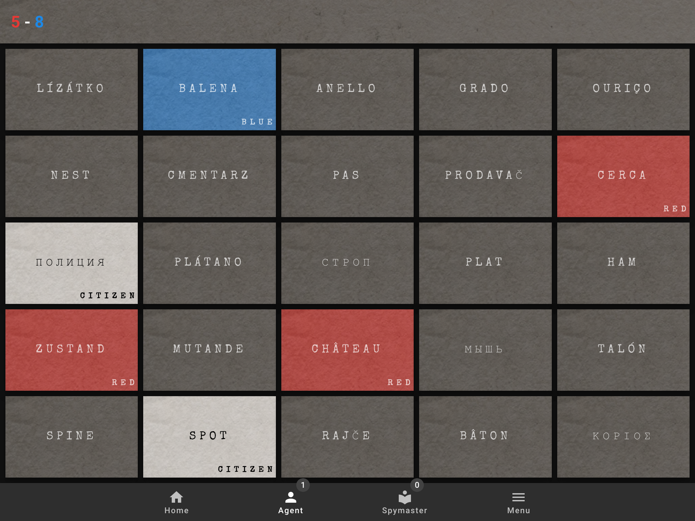
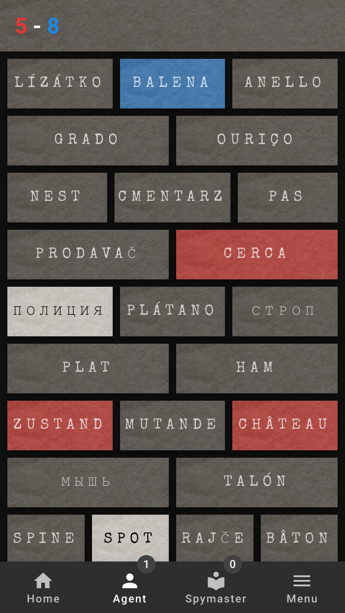
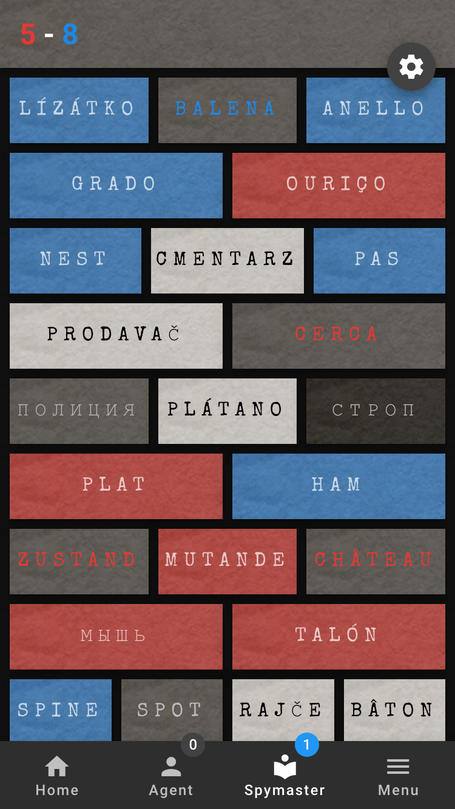

# codenames

> Realtime webapp implementation of the classic social word game, Codenames, designed to be played on a TV and mobile devices. Based on a project by [sprek](https://github.com/sprek).

## Blog Series

To read more about how this project came to fruition and how to build an app using the same technologies, follow the links below!

* __Part 1__ - [Introduction and Planning](https://secdevops.ai/weekend-project-part-1-creating-a-real-time-web-based-application-using-flask-vue-and-socket-b71c73f37df7)
* __Part 2__ - [Enabling Websockets in Flask using Flask-SocketIO](https://secdevops.ai/weekend-project-part-2-turning-flask-into-a-real-time-websocket-server-using-flask-socketio-ab6b45f1d896)
* __Part 3__ - [Scaffolding a Vue App with vue-cli and Managing State with Vuex](https://secdevops.ai/weekend-project-part-3-centralizing-state-management-with-vuex-5f4387ebc144)
* __Part 4__ - [Integrating Websockets into a Real-Time Vue App with Socket.io and Vuex](https://secdevops.ai/weekend-project-part-4-integrating-websockets-into-a-real-time-vue-app-with-socket-io-and-vuex-e358e04f477c)

For content related to development, security, devops, AI, etc... check out [SecDevOps.AI](https://secdevops.ai)!

<p>
  
  
  
</p>

## Rules

Rules for codenames can be found [here](https://en.wikipedia.org/wiki/Codenames_(board_game)#Rules).

## Development

The app uses flask as its back-end and webpack as a front-end dev server.

### Prerequesites

* npm
* python
* pip
* _(optional)_ Gunicorn
* _(optional)_ nginx
* _(optional)_ Foreman (development only)

### Install Dependencies
```bash
# create a virtualenv
virtualenv venv
source venv/bin/activate

# install python and js dependencies
npm run setup

# install dependencies separately
pip install -r requirements.txt
npm install
# or
yarn install
```

### Development Servers

I recommend using Foreman. Foreman allows us to run both servers simultaneously in one terminal window.

```bash
# install foreman
npm i -g foreman
# start foreman
nf start
# both flask and webpack-dev-server should be running

# run servers separately...
# start the flask server on port 5000
npm run flask

# start webpack dev server with hot reload at localhost:8080
npm run serve
# navigate to localhost:8080 in browser
```

## Production

### Build

``` bash
# install dependencies
npm install
pip install -r requirements.txt

# or install both at once
npm run setup

# build for production with minification
npm run build

# build for production and view the bundle analyzer report
npm run build --report
```

#### Running with nginx + Gunicorn

After installing Gunicorn and nginx...

* Add your username and/or project folder path to the configs in the `deploy` directory.
* Copy `deploy/gunicorn.service` to `/etc/systemd/system`
* Copy `deploy/codenames.nginx.conf` to `/etc/nginx/sites-available`
* Create a symbolic link from the new config to `sites-enabled`
